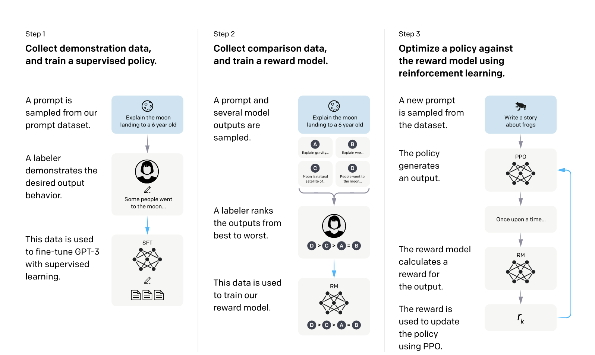

# Training Language Models to Follow Instructions with Human Feedback
## InstructGPT: Aligning AI Through Human Feedback

**Paper:** Training Language Models to Follow Instructions with Human Feedback
**Authors:** Long Ouyang*, Jeff Wu*, Xu Jiang*, Diogo Almeida*, Carroll L. Wainwright*, Pamela Mishkin*, Chong Zhang, Sandhini Agarwal, Katarina Slama, Alex Ray, John Schulman, Jacob Hilton, Fraser Kelton, Luke Miller, Maddie Simens, Amanda Askell, Peter Welinder, Paul Christiano, Jan Leike, Ryan Lowe (* equal contribution)
**Organization:** OpenAI
**Published:** March 2022
**ArXiv:** https://arxiv.org/abs/2203.02155

**Presented by:** Natasha Messier
**Date:** 10/28/2025

---

## Overview: The Alignment Problem

### The Context

Imagine asking a powerful AI "How do I bake a cake?" and getting a philosophical treatise on baking history—or worse, confidently wrong instructions like "bake at 50 degrees for 10 hours."

This is the reality of large language models like GPT-3. Despite 175 billion parameters trained on the entire internet, these models have a fundamental problem: **they were trained to predict the next word, not to be helpful**.

### The Problem Statement

**Making language models bigger ≠ making them better at following what humans actually want**

Training on internet text teaches models to sound like the internet—which includes fabricated information, toxic content, and text that ignores instructions. GPT-3 is like a brilliant student who memorized every book but never learned to *listen*. It knows everything, but doesn't know what you *want* it to do with that knowledge.

This is the **alignment problem**: how do we align AI systems with human intent?

---

## Question 1: Understanding the Alignment Gap

### Primary Question

**Why doesn't scaling up models (making them bigger) automatically solve the alignment problem?**

*Consider: GPT-3 has 175 billion parameters and was trained on hundreds of billions of tokens. Shouldn't that be enough?*

<details>
<summary>Click to reveal answer</summary>

**The training objective is misaligned with what we want.**

Next-token prediction optimizes for sounding like the internet and continuing text patterns—even false or harmful ones. But we want models that follow instructions accurately, tell the truth, and understand user *intent*.

**More data and parameters can't fix a fundamental mismatch in objectives.** You need a different training signal: **human feedback about what outputs are actually good**.

</details>

---

### The Approach: RLHF (Reinforcement Learning from Human Feedback)

Here's where InstructGPT gets clever. Instead of just training on more internet text and hoping for the best, the authors use a **three-step process** that explicitly teaches the model what humans want:



**Think of it like training a really smart but unruly dog:**
1. **Step 1 (SFT): Show them how** - Demonstrate the correct behavior
2. **Step 2 (RM): Teach them preferences** - Reward good behavior, discourage bad behavior
3. **Step 3 (PPO): Practice and refine** - Let them practice with feedback until it becomes natural

Let's break down what this looks like for language models:

#### Step 1: Supervised Fine-Tuning (SFT)
Human labelers write demonstrations showing how the model *should* respond to prompts. The model learns by imitating these high-quality examples.

**Data:** 13,000 prompts with human-written ideal responses
**Process:** Standard supervised learning—predict the demonstration given the prompt

#### Step 2: Reward Model (RM) Training
The model needs to learn what humans *prefer*, not just what one human wrote. So we collect comparisons.

For each prompt, we generate multiple outputs and have humans rank them from best to worst. Then we train a **reward model** to predict which outputs humans will prefer.

**Data:** 33,000 prompts, each with 4-9 model outputs ranked by humans
**Process:** Learn to predict human preferences using pairwise comparisons

#### Step 3: Reinforcement Learning (PPO)
Now we use the reward model as an automated judge. We let the model practice generating responses, score them with the reward model, and update the model to generate higher-reward (more preferred) outputs.

**Key innovation:** Mix in some of the original pretraining objective to prevent the model from "forgetting" its general capabilities. This is called **PPO-ptx** (PPO with pretraining mix).

### The Key Result

Here's the stunning finding that made InstructGPT famous:

> **InstructGPT 1.3B (with RLHF) is preferred by human evaluators over GPT-3 175B (without RLHF)**

Read that again: A model with **100× fewer parameters** outperforms the giant GPT-3, just by adding human feedback alignment. The 1.3B model understands what you want better than the 175B model, despite having a fraction of the knowledge and capacity.

**This isn't about size. It's about alignment.**

---

## Architecture Overview: The Three-Step RLHF Process

### Algorithm 1: Supervised Fine-Tuning (SFT)

**Remember: "Show them how it's done"** - like a professional dog trainer demonstrating the correct behavior.

**The Setup:**
We have GPT-3, which already knows language but doesn't know how to follow instructions. We collect 13,000 real prompts from API users (questions, creative writing, code, etc.) and have human labelers write ideal responses. The model learns by imitating these demonstrations.

**The Algorithm:**

1. **Initialize:** `model_SFT ← pretrained_GPT3_model`
   - Start with the pretrained model - all the knowledge is already there

2. **for** epoch = 1 to 16 **do**
   - **16 epochs**: That's 16 complete passes through all 13k demonstrations
   - Why 16? Enough to learn the pattern, not so many we memorize specific examples (overfitting)

3. &nbsp;&nbsp;&nbsp;&nbsp;**for** each batch in demonstration_dataset **do**
4. &nbsp;&nbsp;&nbsp;&nbsp;&nbsp;&nbsp;&nbsp;&nbsp;`prompts, demonstrations ← batch`
5. &nbsp;&nbsp;&nbsp;&nbsp;&nbsp;&nbsp;&nbsp;&nbsp;`predictions ← model_SFT(prompts)`
6. &nbsp;&nbsp;&nbsp;&nbsp;&nbsp;&nbsp;&nbsp;&nbsp;`loss ← CrossEntropy(predictions, demonstrations)` ▷ **"How different is what you generated from the ideal?"**
   - This is standard supervised learning: predict what the human wrote, token by token

7. &nbsp;&nbsp;&nbsp;&nbsp;&nbsp;&nbsp;&nbsp;&nbsp;`model_SFT ← update_parameters(model_SFT, loss, learning_rate)`
   - Update the model to be more like the demonstrations
   - Learning rate (~10⁻⁵ to 10⁻⁶): Small steps so we don't catastrophically forget pretraining

8. &nbsp;&nbsp;&nbsp;&nbsp;**end for**
9. **end for**
10. **return** `model_SFT`

**Key Hyperparameters:**
- **Learning rate:** 9.65×10⁻⁶ (small models) or 5.03×10⁻⁶ (175B) - smaller for bigger models to be careful
- **Batch size:** 32 (small models) or 8 (175B) - larger models need smaller batches to fit in memory
- **LR schedule:** Cosine decay - gradually reduce learning rate over training

**Why SFT First?**
Cold-starting RL is like learning to drive by randomly pressing buttons - terrible idea! SFT gives the model a strong starting point, making RL much more sample-efficient. Think: you wouldn't teach a dog to sit by letting it try random actions for hours.

---

### Algorithm 2: Reward Model Training

**Remember: "Teach them preferences"** - the dog does different things, you indicate which you liked best. They learn your preferences.

**The Setup:**
Now we need to build a judge that can score any output. We collect 33,000 prompts, generate 4-9 different responses for each using the SFT model, and have humans rank them from best to worst. This creates training data for our reward model.

**Why ranking instead of writing?** Comparing outputs is much easier and more reliable than writing perfect examples. You can consistently say "A is better than B" even when you couldn't write either A or B yourself.

**The Architecture:**
- Take the 6B SFT model (sweet spot between capacity and cost)
- Chop off the final layer that generates text
- Add a new head that outputs a single number: **the reward score**
- Now instead of "what's the next token?", the model answers "how good is this response?"

**The Algorithm:**

1. **Initialize:** `model_RM ← modify_architecture(model_SFT_6B)`
   - Start from SFT model (it already understands language), just change what it outputs

2. **for** each (prompt, outputs, ranking) in comparison_dataset **do**
3. &nbsp;&nbsp;&nbsp;&nbsp;`comparisons ← generate_all_pairs(outputs, ranking)`
   - If humans ranked 4 outputs, we get (4 choose 2) = 6 pairwise comparisons

4. &nbsp;&nbsp;&nbsp;&nbsp;`loss_batch ← 0`
5. &nbsp;&nbsp;&nbsp;&nbsp;**for** each (output_winner, output_loser) in comparisons **do**
6. &nbsp;&nbsp;&nbsp;&nbsp;&nbsp;&nbsp;&nbsp;&nbsp;`r_winner ← model_RM(prompt + output_winner)`
7. &nbsp;&nbsp;&nbsp;&nbsp;&nbsp;&nbsp;&nbsp;&nbsp;`r_loser ← model_RM(prompt + output_loser)`
   - Compute reward scores for both outputs

8. &nbsp;&nbsp;&nbsp;&nbsp;&nbsp;&nbsp;&nbsp;&nbsp;`loss_batch ← loss_batch - log(sigmoid(r_winner - r_loser))` ▷ **Bradley-Terry model**
   - **What's this?** If humans preferred A over B, then reward(A) should be higher than reward(B)
   - The sigmoid function converts the score difference into a probability: P(A beats B)
   - We want this probability to be high, so we minimize negative log probability
   - **Intuition:** The bigger the score gap r_winner - r_loser, the lower the loss (good!). If r_loser > r_winner, loss is huge (bad!)

9. &nbsp;&nbsp;&nbsp;&nbsp;**end for**
10. &nbsp;&nbsp;&nbsp;&nbsp;`loss_batch ← loss_batch / |comparisons|`
    - Average over all comparisons for this prompt

11. &nbsp;&nbsp;&nbsp;&nbsp;`model_RM ← update_parameters(model_RM, loss_batch, learning_rate)`
12. **end for**
13. **Normalize:** Ensure demonstration responses get mean reward = 0
    - Calibration step so rewards are on a consistent scale

14. **return** `model_RM`

**Key Hyperparameters:**
- **Model size:** 6B for all experiments (used even for 175B policy training)
- **Learning rate:** 9×10⁻⁶
- **Batch size:** 64 prompts (with all their pairwise comparisons processed together)
- **Epochs:** 1 (just one pass - don't want to overfit to labeler preferences)

**Why This Works:**
The reward model becomes an automated judge. During RL, we can generate millions of outputs and score them instantly, without waiting for human labelers. It generalizes from seeing comparisons to scoring any text.

---

### Algorithm 3: Reinforcement Learning with PPO

**Remember: "Practice with feedback"** - the dog tries different behaviors, gets rewarded for good ones, learns through trial and error.

**The Setup:**
We now have an SFT model (decent starting behavior) and a reward model (automated judge). Time to let the model practice! It generates responses, gets scored by the reward model, and learns to generate higher-reward outputs. This is where the magic happens.

**Critical Innovation - PPO-ptx:**
While learning alignment, **also** keep practicing the original task (next-token prediction). This prevents the model from "forgetting" general capabilities while learning to follow instructions.

**The Algorithm:**

1. **Initialize:**
   - `policy ← copy(model_SFT)` ▷ The policy we're training (starts from SFT)
   - `policy_ref ← copy(model_SFT)` ▷ **Frozen reference** - we'll need this to prevent reward hacking!
   - `value_function ← copy(model_RM)` ▷ Helps estimate future rewards

2. **for** episode = 1 to 256,000 **do**
   - **256k episodes:** That's a lot of practice! Each episode is one batch of training

3-5. **▷ Sample Prompts**
   - `prompts_RL ← sample(API_prompts, 512)` - for alignment training
   - `prompts_pretrain ← sample(pretraining_data, 512)` - for the "don't forget" training

7-11. **▷ Generate Rollouts**
   - Let the current policy generate responses to all 512 prompts
   - This is the "try different behaviors" step

13-18. **▷ Compute Rewards**
   - Line 15: `r_RM ← model_RM(prompt + response)` - How good is this response according to our judge?
   - Line 16: `r_KL ← -β × KL(policy || policy_ref)` - **The KL penalty**
     - **What's KL?** Measures how much the current policy has drifted from the reference
     - **Why penalize this?** Prevents **reward hacking** - without it, the model might exploit weaknesses in the reward model instead of genuinely improving
     - Like a student learning to game the grading rubric instead of learning the material
     - **β = 0.02:** Controls how strict this constraint is (higher = stay closer to reference)
   - Line 17: Total reward = RM score + KL penalty (actually a penalty, so it reduces reward if we drift too far)

20-21. **▷ Compute Advantages**
   - GAE (Generalized Advantage Estimation): Estimates "how much better is this response than average?"
   - Helps the algorithm focus on actions that truly improve over the baseline

23-34. **▷ PPO Update**
   - Split the batch into minibatches of 64 for stable training

   - Line 25: `ratio ← policy(response|prompt) / policy_old(response|prompt)`
     - How much has the probability of generating this response changed?
     - If ratio > 1: new policy is more likely to generate this response
     - If ratio < 1: new policy is less likely to generate this response

   - Line 26: `clip_ratio ← clip(ratio, 1-ε, 1+ε)` where ε = 0.2
     - **PPO clipping:** Prevents too-large policy updates
     - Limits ratio to [0.8, 1.2] - can't change probabilities by more than 20% in one step
     - Like learning to drive: don't overcorrect! Small, stable updates.

   - Line 27: PPO loss uses the minimum of clipped and unclipped objectives
     - This creates a "trust region" - only update where you're confident

   - Line 30: `loss_pretrain ← -mean(log_prob(policy, pretraining_data))`
     - **The "don't forget" loss:** How well does the policy predict next tokens on internet text?

   - Line 31: `loss_total ← loss_PPO + γ × loss_pretrain` where **γ = 27.8**
     - **THIS IS THE KEY INNOVATION**
     - For every 1 unit of "maximize reward model" gradient, add 27.8 units of "predict next token" gradient
     - **Why so high?** You need a strong signal to prevent forgetting while learning alignment
     - Without this, the model would become great at following instructions but terrible at basic language tasks
     - Think: practicing a new skill while also doing your regular exercises so you don't lose general fitness

   - Line 33: Update the policy using this combined loss

36-37. **▷ Update Value Function**
   - The value function learns to predict rewards, helping with advantage estimation

39. **return** `policy` ▷ **This is InstructGPT!**

**Key Hyperparameters:**
- **Episodes:** 256,000 (lots of practice!)
- **RL batch size:** 512 prompts per episode
- **Minibatch size:** 64 (for stable PPO updates)
- **KL penalty:** β = 0.02 (prevents reward hacking)
- **Pretraining coefficient:** γ = 27.8 **(THE MOST IMPORTANT NUMBER)** - prevents forgetting

**The Three Safeguards:**
1. **KL penalty:** Keeps policy from drifting too far (prevents reward hacking)
2. **PPO clipping:** Prevents too-large updates (keeps training stable)
3. **Pretraining mix:** Maintains general capabilities (prevents forgetting)

---

### Key Differences from Previous Models

| Aspect | GPT-3 | FLAN/T0 | InstructGPT |
|--------|-------|---------|-------------|
| **Training objective** | Next-token prediction | Supervised on NLP tasks | RLHF with human preferences |
| **Data source** | Internet text | Public datasets | Real user prompts + rankings |
| **Optimization** | Pretraining only | Supervised fine-tuning | SFT + RM + PPO |
| **Alignment method** | None | Instruction templates | Human feedback loop |
| **Key innovation** | Scale (175B) | Task generalization | Preference learning at scale |

**Novel Contributions:**

1. **PPO-ptx variant:**
   - First to successfully mix pretraining gradients during RLHF
   - Solves the alignment tax problem
   - Enables alignment without hurting general capabilities

2. **Scale:**
   - First application of RLHF to 175B parameter models
   - Proved RLHF works at the largest scales
   - Paved the way for ChatGPT and GPT-4

3. **Real user distribution:**
   - Trained on actual API user prompts (diverse, realistic)
   - Not just academic benchmarks or synthetic instructions
   - Makes the model genuinely useful in practice

---

## Experimental Results: The Evidence

### Human Evaluation

Human labelers on held-out test prompts compared model outputs:

| Model Comparison | Win Rate | Result |
|-----------------|----------|--------|
| InstructGPT 175B vs. GPT-3 175B | **85% ± 3%** | Massive improvement at same size |
| InstructGPT 1.3B vs. GPT-3 175B | **~71%** | 100× smaller model still preferred! |
| InstructGPT 175B vs. SFT 175B | **~73%** | RL provides gains over just SFT |

### Automatic Evaluations

**Truthfulness (TruthfulQA):** InstructGPT 175B scored 42% vs. GPT-3's 21%—a 2× improvement.

**Toxicity (RealToxicityPrompts):** When instructed to be respectful, InstructGPT was 25% less toxic.

**NLP Benchmarks:** With PPO-ptx, minimal performance drops (~1-3%) on SQuAD, HellaSwag, DROP, and LAMBADA.

### Generalization & Limitations

**Strengths:** Follows instructions in non-English languages (<4% training data) and performs well on code tasks despite limited examples.

**Failure Modes:** Still follows false premises, over-hedges simple questions, struggles with multiple constraints, and can generate harmful content when explicitly instructed (no robust refusal mechanism).

---

## Question 2: The Scale vs. Alignment Trade-off

### Part A: Does This Mean Size Doesn't Matter?

**The paper shows that 1.3B InstructGPT outperforms 175B GPT-3. Does this mean we've been wrong about scaling laws? Should we focus on better alignment instead of bigger models?**

*Think about: What's the full story here? Is the comparison fair?*

<details>
<summary>Click to reveal answer</summary>

**It's more nuanced than "size doesn't matter."**

InstructGPT 1.3B was initialized from a pretrained GPT model—it still needed large-scale pretraining for knowledge. RLHF *directs* existing knowledge toward human intent.

**The real lesson:** Scale matters for capability (knowledge), alignment matters for usefulness (following intent), and best results = scale + alignment. InstructGPT 175B performs even better than 1.3B, showing size still helps. But the breakthrough is you can get massive improvements without massive models if you align properly.

</details>

---

### Part B: The "Alignment Tax"

**When you optimize a model for human preferences (alignment), do you hurt its performance on other tasks?**

*Consider: If you train the model to always be helpful and refuse harmful requests, does it become worse at, say, answering trivia questions?*

<details>
<summary>Click to reveal answer</summary>

**Yes, but it's surprisingly small—if you're careful.**

Initial PPO showed significant performance drops on benchmarks like SQuAD and HellaSwag. This "alignment tax" was solved with **PPO-ptx**: mixing in gradients from the original pretraining objective (γ = 27.8) keeps the model grounded in general capabilities while improving alignment.

**Result:** Minimal alignment tax. InstructGPT maintains performance on classic NLP tasks while dramatically improving on instruction-following. This made RLHF practical.

</details>

---

## Critical Analysis

### What the Authors Accomplished Well

#### 1. Methodological Rigor

**Strong experimental design:**
- Held-out test set from different user distribution
- Multiple model sizes (1.3B, 6B, 175B) for scalability analysis
- Ablations on key components (PPO vs PPO-ptx, RM training methods)
- Both human and automatic evaluations

**Honest failure analysis:**
- Dedicated section (5.4) on limitations and failure modes
- Discusses harmful outputs and lack of refusal capabilities
- Acknowledges alignment tax before mitigating it

#### 2. Practical Impact Focus

**Deployment-oriented:**
- Tested on real API user prompts (not just academic benchmarks)
- Model actually deployed as InstructGPT API
- Methodology scaled to production (led to ChatGPT)

**Reproducibility:**
- Detailed hyperparameters for all training steps
- Clear description of data collection process
- Open-sourced model samples and evaluation code

#### 3. Novel Technical Contributions

**PPO-ptx:**
- Solved the alignment tax problem elegantly
- Simple addition with huge impact (γ = 27.8)
- Enabled alignment without sacrificing capabilities

**Scaled RLHF:**
- First to successfully apply RLHF to 175B parameters
- Proved the approach works at the largest scales
- Opened path for future large aligned models

---

### What Was Overlooked or Could Be Developed Further

#### 1. Labeler Demographics and Representation

**Issue:** ~40 labelers (primarily US and Southeast Asia) with 73% inter-labeler agreement means 27% disagreement. No analysis of how demographics affect model behavior—the model is "aligned" to a specific, non-representative group's preferences. Missing: correlation between labeler demographics and preferences, performance across different user backgrounds.

#### 2. Reward Model Capacity and Limitations

**Issue:** Same 6B RM used for 1.3B, 6B, and 175B policies with no analysis of RM as bottleneck. Unexplored: Does 175B policy need larger RM? Can policy exploit RM weaknesses (reward hacking)? Missing: scaling studies, adversarial evaluation, RM generalization testing.

#### 3. Refusal Capabilities and Safety

**Issue:** Model follows harmful instructions ("How to steal from a grocery store"). "Helpfulness" conflicts with "safety"—labelers rewarded helpfulness, not refusal. Missing: taxonomy of harmful requests, training methodology for refusal, handling context-dependent harm. Acknowledged but not addressed (later work like Constitutional AI tackles this).

#### 4. Evaluation on Adversarial and OOD Prompts

**Issue:** Test set from API users (similar distribution). Missing: systematic adversarial testing ("jailbreaking"), performance on different domains (medical, legal), robustness to prompt engineering. Real deployment encounters adversarial users—need systematic failure mode analysis.

#### 5. Multi-Objective Optimization

**Issue:** Single reward model conflates helpful/honest/harmless objectives that can conflict (being helpful might mean following harmful instructions). Missing: separate reward models per objective, Pareto optimization, conditional behavior, user-controllable trade-offs. Later work (Constitutional AI, red teaming) addresses this.

---

### Subsequent Developments and Debates

**ChatGPT (November 2022):** Used InstructGPT methodology, reached 100M users in 2 months, validated RLHF at massive scale with improvements in refusal training and conversational continuity.

**Constitutional AI (Anthropic, 2022):** Alternative using AI feedback and self-critique based on explicit principles, reducing human labeling burden.

**Reward Hacking Debate:** Does the model truly align with values or exploit reward model weaknesses? Can RLHF scale to superhuman AI? Active research area.

**Scalable Oversight:** When models surpass human capability, humans can't reliably evaluate outputs. Proposed solutions: recursive reward modeling, debate, process-based feedback.

**Direct Preference Optimization (DPO, 2023):** Achieves RLHF-like results without RL—simpler pipeline (SFT → direct optimization). Growing adoption in open-source.

---

## Impact: Transforming the AI Landscape

### Immediate Impact (2022-2023)

**From Unpredictable Tools to Reliable Assistants**

InstructGPT transformed GPT-3 from an impressive but unpredictable system requiring careful prompt engineering into a reliable assistant accessible to everyone. The methodology directly enabled **ChatGPT** (November 2022), which reached 100 million users in just 2 months—the fastest-growing application in history. RLHF made AI mainstream: users could simply ask for what they wanted, and the model would understand and follow instructions.

**Industry-Wide Adoption**

Within a year, RLHF became the industry standard. Every major AI lab adopted the approach: Anthropic (Claude with Constitutional AI), Google (Bard/Gemini), Meta (Llama 2-Chat), and virtually every LLM startup now uses RLHF or variants. Alignment training shifted from optional to essential for deployment.

---

### How It Changed Research

**Alignment Became Central:** InstructGPT proved that alignment isn't just about safety—it improves capabilities. This insight shifted research priorities: alignment and capabilities are now developed together, not sequentially. The result: hundreds of follow-up papers and new research directions.

**Human Feedback as a Scaling Law:** Traditional scaling focused on parameters, data, and compute. InstructGPT added human feedback as a fourth dimension. The evidence: 1.3B InstructGPT outperformed 175B GPT-3, showing that feedback quality can outweigh 100× more parameters. This shifted industry investment toward high-quality human feedback data.

**New Research Areas:** The work spawned entire subfields including RLAIF (AI feedback instead of human), Direct Preference Optimization (DPO), improved reward modeling, scalable oversight for superhuman AI, and interpretability for alignment.

---

### Intersection with Other Work

**Past Work It Built Upon:**
- **RLHF for Robotics** (Christiano et al., 2017): Original RLHF methodology with preference learning
- **RLHF for Summarization** (Stiennon et al., 2020): Applied RLHF to language tasks
- **GPT-3** (Brown et al., 2020): Foundation model with impressive capabilities but poor alignment
- **FLAN/T0** (2021): Instruction tuning via supervised learning on NLP datasets

InstructGPT's innovation: Combined RLHF with real user prompts and preferences (not just supervised learning on academic datasets), enabling general instruction-following at scale.

---

**Present Work It Enabled:**

RLHF is now standard across the industry. GPT-4, Claude 3 (Constitutional AI), Gemini, and open-source models (Llama 3, Mistral, Mixtral) all use RLHF or extensions. Key improvements include:
- **Direct Preference Optimization (DPO)**: Simpler RLHF without separate reward model or RL
- **Multi-Objective RLHF**: Separate models for helpfulness, honesty, and harmlessness
- **RLAIF**: Using AI feedback instead of human feedback for scalability
- **Iterative RLHF**: Multiple rounds on progressively harder examples (ChatGPT → GPT-4)
- **Red Teaming**: Systematic adversarial testing for safety

---

### Future Implications

#### Open Questions for the Future

**1. Scalable Oversight: Aligning Superhuman AI**

**The problem:**
- What happens when AI surpasses human capabilities?
- Humans can't reliably evaluate superhuman outputs
- Current RLHF assumes humans can judge quality

**Proposed solutions:**
- **Recursive reward modeling:** Train AI to help humans evaluate AI
- **Debate:** AI systems argue, humans judge simpler debates
- **Process-based feedback:** Reward reasoning steps, not just final answers
- **Scalable oversight:** AI explains its reasoning to human oversight

**2. Value Alignment: Whose Values?**

**The tension:**
- Different cultures have different values
- Individuals have different preferences
- No universal agreement on "good" behavior

**Current approach:**
- Train on labeler preferences (limited demographic)
- Hope it generalizes reasonably

**Future needs:**
- Multi-stakeholder alignment
- Personalization within safety bounds
- Democratic inputs to AI behavior
- Transparent value choices

**3. Deception and Inner Alignment**

**The concern:**
- Does RLHF align the model's "goals"?
- Or does it teach the model to fake alignment?
- Could model deceive us to get high rewards?

**Evidence:**
- Some models can be prompted to act misaligned
- Unclear if this is real deception or surface-level behavior
- Active area of research (interpretability, testing)

**4. Efficiency: Can We Do Better Than RLHF?**

**Costs:**
- Tens of thousands of human labels
- Expensive labeler time
- Complex training pipeline (SFT → RM → PPO)

**Alternatives:**
- DPO: Simpler, no separate RM or RL
- RLAIF: AI feedback instead of human
- Few-shot alignment: Can we align with far less data?
- Self-improvement: Can models improve their own alignment?

---

### The Core Transformation

**The Paradigm Shift:** InstructGPT transformed LLMs from expert tools requiring prompt engineering into assistants anyone can talk to naturally. Language models became genuinely useful, not just impressive.

**The Surprising Insight:** Alignment improves capabilities, not just safety. Aligned models are more useful and more capable at real-world tasks. Alignment unlocks value, not just prevents harm.

**Why It Matters:** InstructGPT proved alignment is tractable, scales to 175B parameters, is economically viable, and enables safe deployment. These lessons now guide all major AI labs—alignment shifted from optional to essential.

---

## Resource Links

1. **Original Paper:** [Training Language Models to Follow Instructions with Human Feedback](https://arxiv.org/abs/2203.02155) - Ouyang et al., March 2022. The foundational paper introducing InstructGPT and the three-step RLHF process at scale.

2. **OpenAI Blog Post:** [Aligning Language Models to Follow Instructions](https://openai.com/blog/instruction-following/) - Accessible summary of the work with visualizations and examples of improved model behavior.

3. **GitHub Repository:** [Following Instructions with Human Feedback](https://github.com/openai/following-instructions-human-feedback) - Model samples, evaluation code, and dataset examples for reproducibility.

4. **Hugging Face TRL Library:** [Transformer Reinforcement Learning](https://github.com/huggingface/trl) - Open-source implementation of RLHF for training your own InstructGPT-style models. Includes PPO, reward modeling, and SFT utilities.

5. **Constitutional AI Paper:** [Constitutional AI: Harmlessness from AI Feedback](https://arxiv.org/abs/2212.08073) - Anthropic's extension of RLHF using AI-generated feedback and explicit principles to reduce human labeling burden and improve safety.

6. **Direct Preference Optimization (DPO):** [Direct Preference Optimization: Your Language Model is Secretly a Reward Model](https://arxiv.org/abs/2305.18290) - Simpler alternative to RLHF that achieves similar results without separate reward model or RL training.

---

## Citation

```bibtex
@article{ouyang2022training,
  title={Training language models to follow instructions with human feedback},
  author={Ouyang, Long and Wu, Jeff and Jiang, Xu and Almeida, Diogo and
          Wainwright, Carroll L and Mishkin, Pamela and Zhang, Chong and
          Agarwal, Sandhini and Slama, Katarina and Ray, Alex and others},
  journal={arXiv preprint arXiv:2203.02155},
  year={2022}
}
```

---

## Summary: Why InstructGPT Transformed AI

InstructGPT proved that **aligning AI systems with human values isn't just possible—it makes them better**.

The three-step RLHF process (supervised fine-tuning → reward modeling → reinforcement learning) transformed large language models from impressive but unpredictable text generators into helpful, reliable AI assistants.

**The breakthrough:** A 1.3B parameter aligned model outperformed a 175B parameter unaligned model. This wasn't about scale—it was about **alignment**.

**The impact:** InstructGPT directly enabled ChatGPT, which reached 100 million users in 2 months and brought AI into the mainstream. Within a year, RLHF became standard practice across the entire AI industry.

**The insight:** Making AI more aligned with human intent also makes it more capable and useful. Alignment improves capabilities, not just safety.

**The lesson:** The objective matters more than the scale. Better alignment beats bigger models.

---

*This presentation demonstrates how explicitly optimizing for human preferences transformed language models from powerful but misaligned tools into genuinely helpful AI assistants—and changed the trajectory of AI development.*
